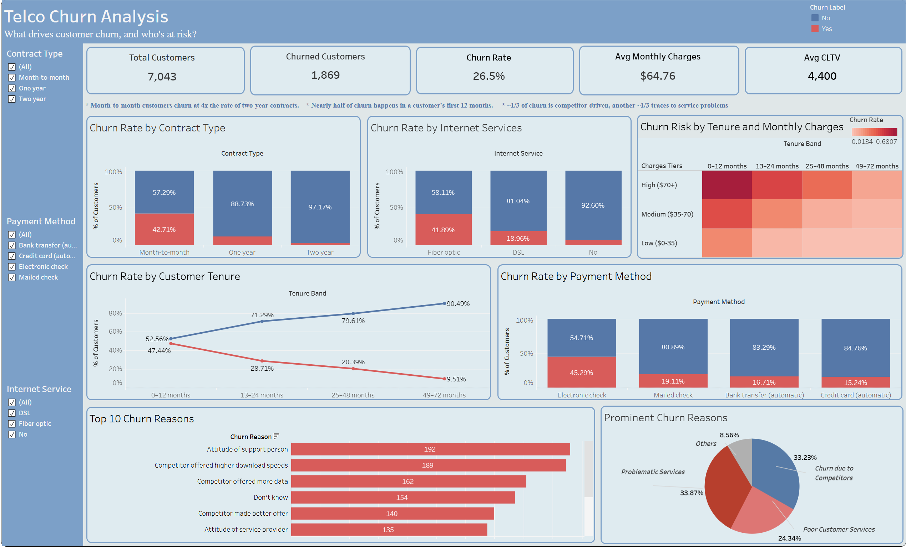
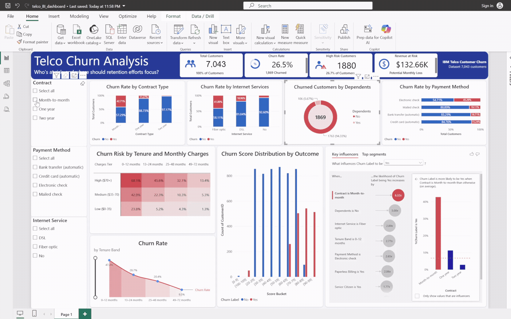

# Telco Customer Churn Analysis

Two dashboards analyzing the same churn dataset, built to demonstrate the same analytical thinking translated across tools, and to explore two different business questions.

- **Tableau** — descriptive: *what's happening with churn?*
- **Power BI** — risk-focused: *who's likely to churn, and where should retention effort go?*

---

## Tableau Dashboard: What's Happening

**[View the live interactive dashboard on Tableau Public](https://public.tableau.com/app/profile/ahmad.nawaz4425/viz/telco_churn_dashboard_17874404917060/TELCOCHURNDASHBOARD)**

### Key findings
- Month-to-month customers churn at roughly 4x the rate of two-year contract customers (42.7% vs 2.8%)
- Nearly half of all churn happens within a customer's first 12 months
- Customers on Electronic check payments churn at 45.3%, more than double every other payment method
- Fiber optic customers churn at over twice the rate of DSL customers
- The single biggest churn driver by volume is dissatisfaction with support staff attitude, ahead of any competitor-related reason
- Highest-risk segment: new customers (0-12 months tenure) paying high monthly charges ($70+)

---

## Power BI Dashboard: Who's at Risk

Rather than duplicating the Tableau dashboard, this version answers a different question: which customers are likely to churn right now, and how much revenue is at stake.

**Interactive file:** [`telco_BI_dashboard.pbix`](telco_BI_dashboard.pbix) — open with the free [Power BI Desktop](https://www.microsoft.com/en-us/power-platform/products/power-bi/downloads) app to explore filters and drill-downs yourself. (Power BI Service publishing requires an organizational email account, so the interactive file and a short demo are provided instead of a hosted link.)

### New findings, beyond the Tableau version
- **Churn Score** (a pre-built risk score in the dataset) correlates far more strongly with actual churn (0.665) than any single factor surfaced in the Tableau analysis
- Defined "high-risk" as Churn Score ≥ 75 after testing several thresholds — this flags 1,880 customers (26.7% of the customer base) with 72.3% of them actually churning, representing **$132.66K in monthly revenue at risk**
- Customers with **no dependents** churn at 32.55%, versus 6.52% for those with dependents — a 5x difference not identified in the initial Tableau analysis
- Cross-validated findings using Power BI's Key Influencers AI feature, which independently confirmed contract type, tenure, and payment method as top churn drivers, and surfaced the dependents relationship automatically

---

## Methodology: how the risk threshold was derived

The dataset includes a pre-built `Churn Score` field (0-100). Rather than treating it as a given, its predictive strength was tested directly:

- Calculated the point-biserial correlation between `Churn Score` and actual churn outcome: **r = 0.665**, meaningfully stronger than any single categorical factor in the dataset (contract type, tenure band, etc.)
- Tested several candidate thresholds for defining "high-risk" customers, checking both the resulting group size and its actual churn rate at each cutoff:

| Threshold | Customers flagged | % of base | Actual churn rate in group |
|---|---|---|---|
| ≥ 60 | 3,640 | 51.7% | 51.3% |
| ≥ 70 | 2,559 | 36.3% | 62.9% |
| **≥ 75** | **1,880** | **26.7%** | **72.3%** |
| ≥ 80 | 1,201 | 17.1% | 92.0% |
| ≥ 85 | 820 | 11.6% | 100.0% |

- Chose **≥ 75** as the working threshold: it captures a focused, actionable segment (27% of the base) while keeping precision high (72% of flagged customers actually churn), rather than flagging over half the customer base (as ≥60 would) or an unrealistically small group (as ≥85 would)
- This threshold feeds

---

## Dataset

[IBM Telco Customer Churn dataset](https://www.kaggle.com/datasets/blastchar/telco-customer-churn), 7,043 customers, 33 original fields covering account details, services subscribed, billing, and churn outcome/reason.

## Tools

- **Python (Pandas)** — data cleaning: handled nulls, dropped non-analytical columns, engineered a tenure-band feature
- **Tableau Public** — descriptive dashboard: 8 visualizations including stacked bar charts, a line chart, a heat map, and a grouped pie chart
- **Power BI Desktop** — risk-focused dashboard: KPI cards, Key Influencers AI visual, Churn Score distribution, and a revenue-at-risk framing built on DAX measures

## Files in this repo

- `telco_churn_clean.csv` — cleaned dataset used for both dashboards
- `telco_churn_cleanup.ipynb` — Jupyter notebook used to clean and prepare the raw data
- `dashboard_preview.png` — static preview of the Tableau dashboard
- `telco_BI_dashboard.pbix` — the Power BI report file
- `dashboard_demo.gif` — short demo of the Power BI dashboard's interactivity